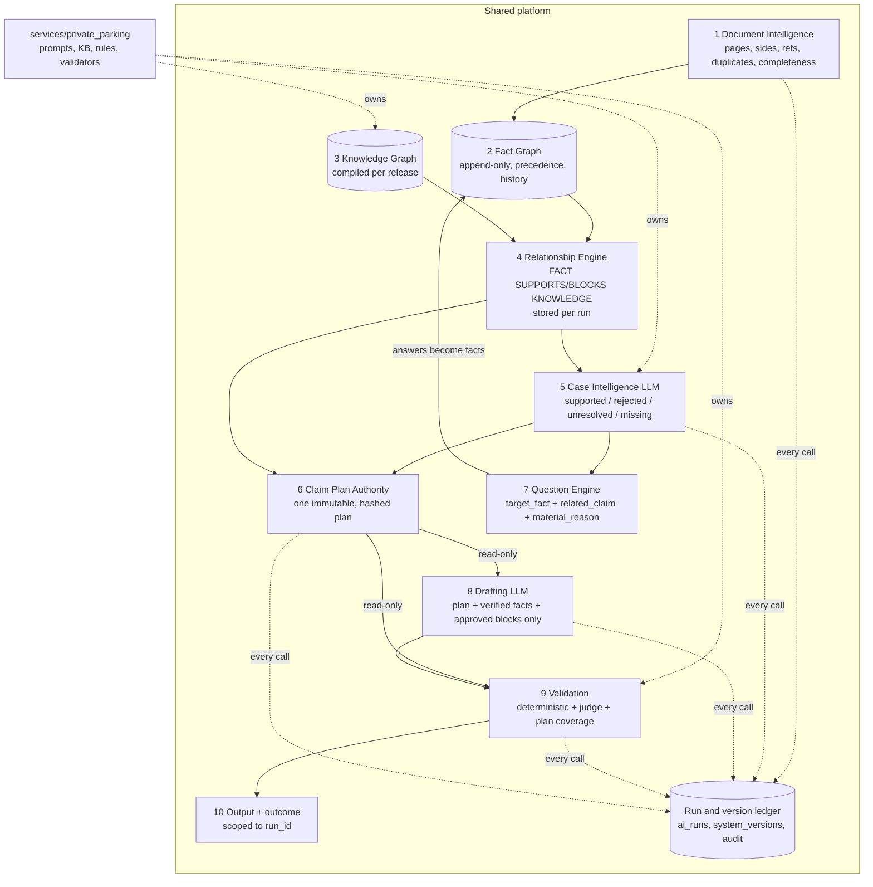

# Architecture review and implementation plan

**Status:** review only, no code changed.
**Branch:** `feature/knowledge-graph-ai-platform` at `563f6e9` (also pushed as `phase-2-intake-router`).
**Date:** 1 October 2026.

## Contents

- [0. Summary](#0-summary)
- [1. Current architecture](#1-current-architecture)
- [2. Target architecture](#2-target-architecture)
- [3. Database ER design](#3-database-er-design)
- [4. Migration plan](#4-migration-plan)
- [5. Files and components affected](#5-files-and-components-affected)
- [6. Implementation phases](#6-implementation-phases)
- [7. Risk analysis](#7-risk-analysis)
- [8. Testing strategy](#8-testing-strategy)
- [Decisions needed before Phase 1](#decisions-needed-before-phase-1)

## 0. Summary

The platform is closer to the target than the problem list suggests. These parts already exist and work:
- a neutral classifier and service router;
- normalised Postgres storage with superseded fact rows;
- a networkx knowledge graph built from versioned YAML;
- a claim-plan builder that never adds grounds itself;
- a deterministic validator;
- a run-time drift check on KB and prompt versions.

The weaknesses come from four structural gaps, not from missing components:

1. **Facts are not protected.**
   - `CaseFile.put` overwrites any fact with no precedence check and no in-memory history (`models.py:162`).
   - One engine hard-deletes facts with no audit entry (`account._clear_material`, `account.py:440-466`).
   - Re-extraction can replace a fact the customer confirmed (`extraction.py:382`).
2. **The claim plan is not final.** After it is built, eight separate places can still change what the letter argues:
   - the re-analysis loop, which runs again while nothing can lead;
   - re-gating in `reasoning.analyse`, which drops grounds silently;
   - `widen`;
   - the drafter leaving grounds out;
   - sentence dropping after validation;
   - template block skips;
   - `_with_closing`;
   - the support-only hold.

   Nothing checks that every planned ground was actually argued.
3. **Outcomes are read from the whole case history.** `classify_hold` builds its event set from every audit entry ever written (`outcome.py:93`), so an earlier run's events can mislabel a later failure. Nothing scopes events to a run.
4. **Versions are recorded only partly.**
   - Model and prompt version are recorded for drafting only.
   - Extraction, classification, analysis and validation versions are not recorded per case.
   - KB module versions are not stored with the draft.
   - Nothing records which versions produced a given outcome.

Defects found during the review that I have **verified in the code**:

| # | Defect | Where | Effect |
|---|---|---|---|
| D1 | The route is compared with `"LAND"`, but the KB route is `LANDOWNER` | `analysis.py:772,776`, `recovery.py:648,666` | Landowner authority counts as a "fact-specific" ground. That suppresses questions about the trade association and the site postcode. |
| D2 | The LLM validation judge is never connected | `orchestrator.py:112` (`judge=None`); `api.py:275` | Only the deterministic validator runs. The "separate model" release gate (`DISTINCT_FROM`) has no effect. |
| D3 | The postcode question I added in `563f6e9` sends `material_because`, including module IDs, to the customer | `orchestrator.py:179` | Breaks the rule that `material_because` is never shown (`analysis.py:591`). **My regression, on the pushed branch.** |

Reported by the code survey, to be verified when each is fixed:

| # | Defect | Where |
|---|---|---|
| D4 | The drafter receives raw customer wording through `case_context.customer_source_texts`. This contradicts the drafter's own contract. | `reasoning.py:366-378,441`; `drafter.py:3-6` |
| D5 | A failed reassessment is not counted as an analysis failure, and the round limit writes no `case_analysis` event, so the pack can carry a stale claim plan | `analysis.py:224-279`; `reasoning.py:424-430` |
| D6 | A model `grounds` entry that is not a dict raises an uncaught error | `analysis.py:487` |
| D7 | The fact `authority_challenge_proportionate=True` is written whenever the model proposes KB-LAND-01, and never cleared | `claim_plan.py:115-125` |
| D8 | Questions raised inside the "until a ground can lead" loop are never shown, but are marked as asked, so they can never be asked later | `orchestrator.py:155-158, 504-542` |
| D9 | The drift check ignores block text. `store sync` overwrites rows with the same version. `kb_releases` is upserted, although its own comment calls it immutable. | `kb_source.py:31-34`; `kb_sync.py:76-145` |
| D10 | The error message tells you to run `store sync --publish`, but the CLI rejects that flag | `api.py:190`; `store/__main__.py:53` |
| D11 | `analysis_module_ids` and `recovery_report` are not saved, so they are lost on reload | `store/cases.py` |
| D12 | The KB admin endpoints return 501 and have no admin check | `api.py:991-1001` |

**Recommendation:** evolve the current system. Don't rebuild it.

- Every target layer maps onto an existing module.
- The real work is to:
  - make facts append-only;
  - make the claim plan immutable;
  - make every run carry its versions;
  - turn the KB's DSL gates into explicit relationships.
- That gets explainability without a second engine running beside the first.

## 1. Current architecture

```mermaid
flowchart TD
  U[Upload<br/>api.py /cases/{id}/files] --> I[Intake<br/>classifier + page_references + router]
  I -->|route has no engine| STOP[Scope stop / redirect]
  I -->|private parking| DC[Completeness gate<br/>notice_pages_sufficient]
  DC -->|fail| R422[422 + reset]
  DC --> EX[Extraction LLM<br/>facts put, no precedence]
  EX --> CONF[Confirm screen<br/>CORRECTED / CONFIRMED]
  CONF --> ACC[Account engine<br/>hard-deletes material facts]
  ACC --> REC[Recovery + calculators<br/>PoFA, keeper warning, jurisdiction]
  REC --> CA[Case analysis LLM<br/>sees raw narrative + all facts]
  CA --> CP[build_claim_plan<br/>gates, excludes, never adds]
  CP --> RA{{Reassessment LLM}}
  RA --> Q[Questions<br/>LLM proposals + filters<br/>+ pcn conflict + postcode]
  Q -->|answers| ACC
  CP --> LOOP{{Re-analyse while nothing leads<br/>MUTATES PLAN}}
  LOOP --> RP[reasoning.analyse<br/>RE-GATES / DROPS grounds, priority]
  RP --> HOLD{leading ground?}
  HOLD -->|no| H1[Hold: NO_SUPPORTED_GROUNDS / NEEDS_FACTS]
  HOLD -->|yes| DR[Drafting LLM<br/>may omit grounds]
  DR -->|no_ground| WID{{widen pack<br/>MUTATES}}
  DR --> CL[_with_closing]
  CL --> VAL[Deterministic validator<br/>judge NOT wired]
  VAL -->|fail x3| DROP{{drop failing sentences<br/>MAY REMOVE A GROUND}}
  VAL -->|pass| OUT[RELEASED letter + PDF]
  DROP --> OUT
  VAL --> OC[classify_hold<br/>reads WHOLE audit history]
  classDef bad fill:#fde2e1,stroke:#c0392b;
  class LOOP,RP,WID,DROP,ACC,OC bad
```

Pink marks where facts or grounds can change outside a single point of authority. Where each layer lives today:

| Target layer | Today | Main gap |
|---|---|---|
| Document Intelligence | `ingest.py`, `intake/`, `notice_completeness.py` | Pages are not stored as rows with side and references. Completeness is computed but not recorded as a document fact. |
| Fact Graph | `models.Fact`, `CaseFile.put`; `facts` table (superseded rows) | No precedence rule and no history in memory. Hard deletes. Status is changed in place. Some outputs are not persisted. |
| Knowledge Graph | `kb_modules.yaml` (55 modules, 20 fields each), `building_blocks.yaml` (74), `kg/graph.py` (networkx, typed edges) | No SUPPORTS or BLOCKS edges (gates are DSL predicates). Blocks have no version. `effective_from` and `last_legal_review` are empty on every module. |
| Relationship engine | `rules/dsl.py` evaluate, `claim_plan` exclusion reasons | Decisions are explained in trace strings, not stored as relationships. |
| Case Intelligence | `engines/analysis.py` | Sees the raw narrative. Reassessment and round-limit edge cases (D5). |
| Claim Plan Authority | `engines/claim_plan.py` | It isn't final: 8 mutation points come after it. |
| Question Engine | `analysis._safe_questions` plus two hard-coded questions in the orchestrator | Questions don't name the claim they serve. `_unlocking_questions` and `SITUATION_FALLBACK` are dead code. |
| Drafting | `drafting/drafter.py` (LLM drafter plus template helpers) | No enforced structure. Receives raw customer text (D4). |
| Validation | `engines/validation.py`, about 25 rules | Doesn't check that every planned ground is argued. Judge not wired (D2). |
| Output | `orchestrator.render`, `pdf.py`, `engines/outcome.py` | Outcome scoping (gap 3). |
| Services | `services/` registry, 9 routes, 1 live | Already has the target shape. Prompts and KB are still global. |
| Governance | git, change logs, `store sync`, `/health` | No who/why/affected-cases record. Admin endpoints are stubs. |

## 2. Target architecture



### Contracts that make the layers controlled

**Fact Graph**
- Every write is an append, recording: who, what, why, the previous value, the source, confidence and `run_id`.
- A current value can only be replaced by a write of equal or higher precedence:
  CORRECTED > CONFIRMED > CUSTOMER_ANSWER > DOCUMENT > EVIDENCE > CALCULATION > SYSTEM_DERIVED > CUSTOMER_FREE_TEXT.
- A lower-precedence write is kept in the history and doesn't change the current value.
- Nothing is ever deleted. A retraction is a write of `status=RETRACTED` with a reason.
- Driver disclosure is its own fact. Only an explicit disclosure answer, or an admin correction, can write it. The narrative can never set it.
- Customer free text produces only facts of kind `CUSTOMER_FREE_TEXT`, never legal conclusions. For example, `children_present=true` and `customer_described_event=true`, with `driver_disclosed_to_operator` left untouched.

**Relationship Engine**
- For each run, the engine evaluates every candidate node's `use_when`, `do_not_use_when` and `requires_facts` against the current facts.
- It stores each result as a relationship: `fact SUPPORTS node`, `fact BLOCKS node`, or `node REQUIRES fact (missing)`.
- Those stored rows are the explanation for every decision, replacing trace strings.

**Case Intelligence**
- Input:
  - verified facts;
  - a **neutral account summary** made from the free-text facts (not the raw narrative);
  - evidence;
  - only the nodes the relationship engine marked as candidates.
- Output schema: `supported`, `rejected` (with a reason), `unresolved` (with the facts each needs) and `missing_material_facts`.
- Anything the model names that is not a candidate is refused and recorded.

**Claim Plan Authority**
- All analysis rounds and questions happen **before** the plan is final.
- The final plan is one row: `status=FINAL`, a content hash, and the run that produced it.
- Drafting and validation get a read-only copy.
- After finalisation:
  - any change, including a ground dropped by re-gating, is an error: a PROCESSING_ERROR with a reason, never a silent change;
  - the only allowed outcomes are RELEASED, or a hold that names the plan.
- Support-only plans end before drafting (already done in `563f6e9`).

**Question Engine**
- A question is created only from an `unresolved` claim, or the counterfactual check (a generalised `postcode_unlocks`): "if this fact had value X, would claim C's gate change?"
- Required fields: `target_fact`, `related_claim`, `material_reason`, `source` (LLM or system).
- The customer sees only `text`, `type` and `options`.

**Drafting**
- Input: the final plan, verified facts, uploaded evidence IDs and approved blocks only. No raw customer text.
- Fixed six-part structure, with each part tagged:
  1. keeper introduction
  2. operator allegation
  3. relevant facts
  4. supported argument, one section per planned claim
  5. evidence request
  6. cancellation request (PP-END-001/002)

**Validation**
- The existing deterministic rules.
- **Plan coverage:** every planned claim is argued, and nothing outside the plan is argued.
- **Structure:** all six parts are present.
- **Judge:** a different model, no longer optional in production.
- Validation never adds content. Sentence dropping is allowed only when the plan stays fully covered afterwards.

**Outcome**
- Derived only from the events of the current `run_id`.
- A technical failure always maps to PROCESSING_ERROR. A typed exception class marks a step as technical.

**Services**
- Keep the `services/` registry.
- When a second service goes live, each service package gets its own `prompts/`, `knowledge/`, `rules/` and `validators/` folders.
- The shared engines take the service as a parameter. No second service is built in this programme.

## 3. Database ER design

PostgreSQL. The plan extends the existing schema (`infra/postgres_schema.sql`) rather than replacing it. Existing tables keep their names where they already match.

Every table has:
- a UUID primary key (`gen_random_uuid()`);
- `created_at` and `created_by`;
- `version` or `superseded_by` where rows can change.

```mermaid
erDiagram
  cases ||--o{ documents : has
  documents ||--o{ document_pages : has
  cases ||--o{ facts : current
  facts ||--o{ fact_history : versions
  documents ||--o{ evidence : "is evidence"
  evidence ||--o{ evidence_fact_links : supports
  facts ||--o{ evidence_fact_links : "supported by"
  knowledge_releases ||--o{ knowledge_nodes : contains
  knowledge_nodes ||--o{ knowledge_edges : from
  knowledge_nodes ||--o{ knowledge_edges : to
  cases ||--o{ ai_runs : has
  system_versions ||--o{ ai_runs : "ran under"
  ai_runs ||--o{ fact_knowledge_links : produced
  facts ||--o{ fact_knowledge_links : in
  knowledge_nodes ||--o{ fact_knowledge_links : about
  ai_runs ||--o| claim_plans : finalises
  claim_plans ||--o{ claim_plan_items : lists
  knowledge_nodes ||--o{ claim_plan_items : cites
  claim_plan_items ||--o{ questions : "asks for"
  questions ||--o| answers : answered_by
  answers ||--o{ fact_history : writes
  claim_plans ||--o{ drafts : drafted_from
  drafts ||--o{ validations : checked_by
  cases ||--o{ audit_logs : logs
  ai_runs ||--o{ audit_logs : logs
  governance_changes ||--o{ knowledge_releases : publishes
```

| Table | Key columns | Notes and origin |
|---|---|---|
| `cases` | case_id, customer_id, service, route, state, driver_status, current_run_id, retention_until | Exists. Adds `service` and `current_run_id`. |
| `documents` | document_id, case_id, label (E1), document_type, stage, confidence, sha256, storage_key, classification (jsonb), pages_complete, completeness_reason | Rename of `evidence`, plus the classifier output as columns. |
| `document_pages` | page_id, document_id, page_no, side, sha256, pcn_read, vrm_read, image_ref | Extends `evidence_pages`: per-page side and references, so duplicate and different-notice checks are stored. |
| `facts` | fact_id, case_id, name, value (jsonb), source_kind, status, confidence, current_history_id, updated_at | **Current-value table**, one row per (case, name). Always derived from `fact_history`. |
| `fact_history` | history_id, case_id, name, value, previous_value, source_kind, source_ref, excerpt, status, confidence, precedence, accepted (bool), reason, run_id, actor, created_at | Append-only. Created from the existing `facts` rows (they already have `superseded`). UPDATE and DELETE are revoked. |
| `evidence` | evidence_id, case_id, document_id, kind (RECEIPT, PERMIT…) | Supporting evidence, distinct from the notice documents. |
| `evidence_fact_links` | evidence_id, history_id, relation (SUPPORTS / CONTRADICTS) | EVIDENCE → SUPPORTS → FACT. |
| `knowledge_releases` | release_id, manifest, content_hash, published_by, published_at, governance_change_id | Replaces `kb_releases`. Insert-only, never upserted. |
| `knowledge_nodes` | node_id, stable_key (KB-BAY-01), node_type (MODULE / BLOCK / LEGAL_SOURCE / QUESTION / CODE_VERSION), service, version, status, effective_from, effective_to, category, use_when, do_not_use_when, requires_facts, supporting_evidence, blocked_by, prohibited_claims, drafting_guidance, text, strength, content_hash, release_id | Compiled from YAML for each release. Unique on (stable_key, version). Blocks get versions. |
| `knowledge_edges` | edge_id, release_id, from_node, to_node, edge_type (REQUIRES, BLOCKED_BY, CONFLICTS_WITH, EXPRESSED_BY, CITES, HELPED_BY), predicate (jsonb) | Generated from the DSL and the module fields, never hand-written. |
| `fact_knowledge_links` | link_id, run_id, node_id, fact_name, history_id, relation (SUPPORTS / BLOCKS / REQUIRES_MISSING), satisfied | The stored explanation, one set per run. |
| `ai_runs` | run_id, case_id, step (CLASSIFY / EXTRACT / ANALYSE / DRAFT / VALIDATE / JUDGE), service, model, prompt_key, prompt_version, system_version_id, input_hash, output (jsonb), status (OK / ERROR), error, latency_ms, cost | Every LLM call and every deterministic engine step. |
| `system_versions` | system_version_id, commit_sha, build_id, environment, knowledge_release_id, prompt_versions (jsonb), model_map (jsonb), validator_version, created_at | One row per deployed configuration. |
| `claim_plans` | plan_id, case_id, run_id, status (DRAFT / FINAL / SUPERSEDED), content_hash, outcome_intent, finalised_at | At most one FINAL plan per run. |
| `claim_plan_items` | item_id, plan_id, node_id, disposition (SUPPORTED / REJECTED / UNRESOLVED), reason, missing_facts, order | Supported, rejected and unresolved claims. |
| `questions` | question_id, case_id, run_id, target_fact, related_item_id, material_reason, source, text, type, options, status (SHOWN / ANSWERED / SKIPPED / WITHDRAWN) | Fixes D8: "asked" means shown. |
| `answers` | answer_id, question_id, raw_text, parsed_value, polarity, created_at | Replaces `raw_answers`. Writes to `fact_history`. |
| `drafts` | draft_id, plan_id, run_id, structured, letter, model, prompt_version | Exists. Linked to the plan. |
| `validations` | validation_id, draft_id, run_id, passed, issues, coverage (jsonb), judge_run_id, validator_version | Exists. Adds coverage and judge. |
| `audit_logs` | audit_id, case_id, run_id, actor, event, detail, created_at | Exists as `audit_log`. Adds `run_id`, plus a REVOKE on UPDATE and DELETE. |
| `governance_changes` | change_id, object_type (KNOWLEDGE / PROMPT / MODEL / RULE / VALIDATOR), object_key, from_version, to_version, what, why, requested_by, approved_by, affected_cases_query, affected_case_count, created_at | Governance record: what, why, who, version, affected cases. |

## 4. Migration plan

Additive first, then switch over, then retire. Each step can be deployed and rolled back on its own.

1. **Schema (additive).**
   - Create the new tables alongside the old ones.
   - Add `run_id` to `audit_log`.
   - No reads change yet.
2. **Backfill.**
   - `fact_history` from the existing `facts` rows. Superseded rows are already ordered by `created_at`.
   - `documents` and `document_pages` from `evidence` and `evidence_pages`.
   - `knowledge_nodes` and `knowledge_edges` from the current release manifest.
   - Existing cases get a synthetic `run_id` per stored draft.
   - Run the backfill on a Neon branch first, then compare row counts and spot-check 20 cases.
3. **Dual write.**
   - The new `FactStore` writes to both `fact_history` and the legacy `facts` table.
   - `ai_runs` and `system_versions` are written from day one: they are append-only and safe.
4. **Switch reads.**
   - Load facts from the current-value table.
   - The outcome reads the current run.
   - Drafting and validation read `claim_plans`.
   - Behind a flag (`PLATFORM_V2=1`), staging only, until the golden corpus (section 8) matches.
5. **Retire.**
   - Stop the legacy writes.
   - Keep the old tables read-only for a retention period, then drop them in a later release.

**Rollback at every step:** turn off the flag, or redeploy the previous build. The new tables are additive, so the old code ignores them.

## 5. Files and components affected

| Area | Files | Change |
|---|---|---|
| Fact Graph | `models.py` (`Fact`, `CaseFile.put`, `get`, `fact_view`); new `facts/store.py`; `engines/account.py` (`_clear_material`); `engines/extraction.py` (unconditional put at 382, in-place status changes at 396-567); `engines/recovery.py` (unguarded puts); `engines/questioning.py`; `disclosure.py`; `store/cases.py` | Precedence-guarded append, no deletes, persist `analysis_module_ids` and `recovery_report` |
| Run ledger and versions | `llm.py` (one wrapper around `complete_json`); `prompts.py`; new `runs.py`; `version.py`; `api.py` (`/health`, new `/version`); `store/cases.py` | Every call recorded, with its versions |
| Outcome scoping | `engines/outcome.py`; `orchestrator._with_outcome` | Events filtered by `run_id`; typed technical errors |
| Knowledge compile and relationships | `kg/graph.py`; `rules/dsl.py` (expose referenced facts per clause); `store/kb_sync.py`, `kb_source.py`; `data/*.yaml` (block versions, effective dates); new `knowledge/relations.py` | SUPPORTS/BLOCKS/REQUIRES from the DSL; insert-only releases; content-hash drift check |
| Case Intelligence | `engines/analysis.py` (payload, output schema, D5, D6, D1); `data/prompts.yaml` (case_analysis output contract) | Candidates only; four-part output; neutral account summary |
| Claim Plan Authority | `engines/claim_plan.py` (D7); `orchestrator.py` (`_reanalyse`, `_analyse_until_a_ground_can_lead`, `generate`, widen, `_without_failing_sentences`); `engines/reasoning.py` (re-gating becomes an assertion) | One FINAL plan; mutation after it is an error |
| Questions | `engines/analysis.py` (`_safe_questions`, remove dead code); `orchestrator.py` (`_pcn_conflict_question`, `_site_postcode_question`, D3); `data/questions.yaml` | Question contract; generalised counterfactual check |
| Drafting | `drafting/drafter.py`; `engines/reasoning.py` (`case_context`, D4); `data/prompts.yaml` (drafting structure) | Six-part structure; no raw customer text |
| Validation | `engines/validation.py` (coverage and structure rules); `orchestrator.py` and `api.py` (connect the judge, D2) | Coverage check, judge |
| Services | `services/base.py`, `services/private_parking/`, `services/__init__.py` | Service parameter on the shared engines; layout per service |
| Governance | `api.py` admin routes (D12); `store/__main__.py` (D10); `web/console.html` | Change records; dual control; affected-case query |
| Schema | `infra/postgres_schema.sql`; `tests/sqlite_store.py` | Section 3 |
| Frontend | `frontend/components/ResultStep.tsx`, `QuestionsStep.tsx`, `lib/types.ts` | NEEDS_FACTS with questions; links that go nowhere (`/resources`, `/council-pcn`) |

## 6. Implementation phases

Each phase is its own change package, using the usual change control (WHAT / WHY / ROOT CAUSE / BLAST RADIUS / NOT CHANGING / TEST PLAN / DEPLOYMENT). Each must pass the golden corpus before the next starts.

| Phase | Scope | Exit criteria |
|---|---|---|
| **P0 Stabilise** (small, before Meme's next test) | D1, D3, D6, D10; the reassessment-failure event and the stale-plan fix (D5); D8 (asked means shown) | Unit tests for each defect; corpus unchanged except for the intended changes |
| **P1 Fact Graph** | `FactStore` with precedence and history; no hard deletes; persist the analysis outputs; `fact_history` backfill | Invariant tests: no fact disappears, and a confirmed value is never replaced by a lower-precedence one; reloads identical |
| **P2 Run and version ledger** | `ai_runs`, `system_versions`, `run_id` on audit; outcome scoped to the run; `/version` | Every LLM call has a row; the outcome ignores earlier runs; staging shows the commit, release, prompt and model versions |
| **P3 Claim Plan Authority** | One FINAL plan; all rounds before it; post-plan changes become errors; coverage validator | Plan hash identical before drafting and after validation; coverage rule blocks an omitted ground |
| **P4 Question Engine** | Question contract; counterfactual materiality for every system question; remove dead code | Every shown question has `target_fact`, `related_claim` and `material_reason`; no question from an empty field |
| **P5 Knowledge compile and relationships** | `knowledge_nodes` and `knowledge_edges` per release; insert-only releases; content-hash drift; block versions; per-run `fact_knowledge_links`; console "why" view | Every selected or rejected claim explained by stored relationships |
| **P6 Drafting and validation** | Six-part structure; neutral account summary (D4); judge connected (D2) | Structure and coverage rules pass on the corpus; judge disagreements logged |
| **P7 Governance** | Admin change API with dual control (D12); affected-case query; console | Each change records what, why, who, version and affected cases |
| **P8 Next service** (separate programme) | Per-service prompts, KB and validators, starting with the first redirect service the client prioritises | — |

P0 is small. P1 to P3 carry most of the value and should be done in order.

## 7. Risk analysis

| Risk | Likelihood | Impact | Mitigation |
|---|---|---|---|
| Letters change in ways nobody intended once the plan is enforced (for example, a ground the drafter used to drop now has to be argued) | High | Medium | Golden corpus diff on every phase; client review of changed letters before release |
| The fact precedence rule blocks a legitimate correction path | Medium | High | Admin correction is the highest precedence; every refused write is visible in `fact_history` with `accepted=false` |
| Backfill mismatches on existing cases | Medium | Medium | Neon branch dry run; row-count and spot checks; dual write before switching reads |
| Model nondeterminism hides regressions | High | Medium | Run each corpus case N times; measure outcome and plan stability, not exact text |
| A stricter question contract means fewer questions and so weaker letters | Medium | Medium | Measure the share of cases with a leading ground before and after; counterfactual checks recover the material questions |
| Connecting the judge adds cost and latency, and its false blocks hold good letters | Medium | Medium | Shadow mode first (log only); turn on blocking per rule after review |
| Scope creep into new services | Medium | High | P8 is a separate programme |
| Client wording approval delays phases | High | Low | Wording changes are kept out of P0–P5; only P6 touches letter structure |
| Personal data spreads into new tables (`fact_history`, `ai_runs.output`) | Medium | High | Store hashes and references rather than full outputs where possible; `ai_runs.output` follows `retention_until`; no keeper name or address in logs |
| Performance: more rows per case | Low | Low | Index (case_id, name) and run_id; history is small per case |

## 8. Testing strategy

1. **Baseline guard.** Keep comparing the full suite against the 29 known stale failures by test id. Separately, fix or delete the stale tests, so the baseline reaches zero by P3.
2. **Per-layer unit tests**, with fictitious data only and no operator- or case-specific rules:
   - **Fact Graph invariants:** history is append-only; precedence is enforced; no deletion; narrative never sets driver disclosure.
   - **Relationships:** each DSL clause yields the expected SUPPORTS, BLOCKS or REQUIRES links.
   - **Plan authority:** plan hash unchanged across drafting and validation; any mutation raises.
   - **Questions:** each shown question carries the contract; a counterfactual test for each system question.
   - **Outcome:** an earlier run's events never affect the current outcome; technical errors map to PROCESSING_ERROR.
3. **Contract tests on LLM boundaries.** Every `complete_json` task has a schema, and a broken or out-of-candidate response is refused with a recorded reason (covers D6).
4. **Golden corpus.**
   - The client's 16 live uploads plus a fictitious set covering every route. In repo tests, the uploads are referenced by hash only, with no personal data.
   - Each case runs 5 times. Record: route, upload decision, the final plan's claim set, outcome, presence of the six letter parts, validation result, and the questions asked.
   - **Pass:** the outcome and the claim set are stable across all 5 runs, and match the approved expectations.
5. **Persistence.** Save, reload and compare after every step, as the live runner already does.
6. **Staging verification** before each client test:
   - `/version` matches the commit, knowledge release, prompt versions and model map;
   - the frontend build matches the backend commit;
   - the corpus passes on staging.
7. **Change evidence.** No phase is reported as "fixed" without the unit tests, the corpus diff and the staging check.

## Decisions needed before Phase 1

1. **Raw narrative.** Should the Case Intelligence LLM see the raw narrative, or only a neutral summary made from the free-text facts? I recommend the summary for drafting (D4). Analysis may need the raw account to find facts, but should not quote it.
2. **Fact precedence order.** Proposed in section 2. Should "customer answer" outrank "document"? I recommend it does not for identifiers (PCN, VRM, dates), and does for the customer's circumstances.
3. **Validation judge.** Is a second model acceptable on cost? If yes, start in shadow mode.
4. **Staging.** Which Railway and Vercel environments are staging? There is no committed staging configuration today.
5. **P0 timing.** P0 includes reverting my own D3 regression. Should P0 go out before Meme's next test?
